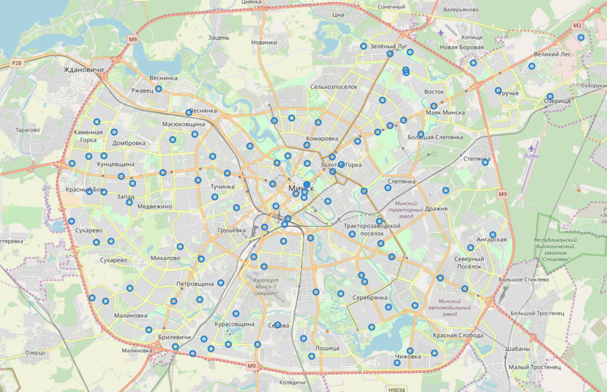
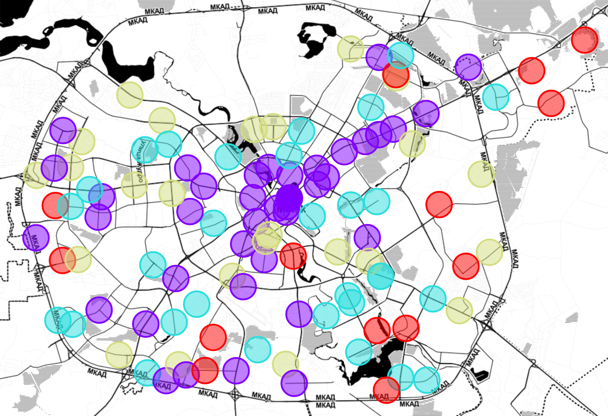

# Explore Locations For Coffee Shops in Minsk, Belarus

**Table of Contents**
* [Introduction](#introduction)
* [Data](#data)
* [Methodology](#methodology)
* [Results](#results)
* [Discussion](#discussion)
* [Conclusion](#conclusion)

## Introduction

Coffee is the world’s most popular beverage, it’s a universal drink that appeals to the majority of the population, 
and inexpensive to prepare. Thanks to this popularity coffee shops are considered profitable businesses 
that are relatively easy to operate. However, while it may appear to be easy, opening a coffee shop business requires 
a lot of insight, research, and planning. 

Coffee shops are a great place to socialize: to meet friends, for informal meetings, or for students 
to catch up on schoolwork. Given the above having a great location is obviously very important for attracting customers. 
To be successful, you need the right location for your coffee shop. You probably want something centrally located, 
a place where people already gather. Moreover, while you may not have direct competitors, the substitutes 
also play an important role at filling the needs of your customers. Substitutes can include places like cafe or 
donut shops – or any fast food place that serves coffee.

Even, if you are franchising or buying an existing business the location is pre-selected but you should still do your 
research and decide whether the existing or selected location is a good one.

In this research I will focus on choosing a right location for a new coffee shop in Minsk, Belarus. 
I am going to analyze location statistics for existing coffee shops, indirectly count customers and 
visits using check-ins, and look at existing substitutes. 

## Data

I am going to leverage Foursquare as a main source of data in this study. Foursquare is a technology company 
that built a massive dataset of location data. Currently its location data is the most comprehensive out there, 
and quite accurate that it powers location data for many popular services like Apple Maps, Uber, Snapchat, Twitter 
and many others, and is currently being used by over 100,000 developers, and this number is only growing.

The Foursquare APIs will be used to extract the following informations:
* Locations of the existing coffee shops
* Details for existing coffee shops like number of checkins, number of unique users
* Locations and categories of substitute venues in *coffee* category

As a part of my analysis I am going to look at neighborhoods in Minsk. There are nine districts in the city, 
but this division looks too coarse for our goals. At the same time, location of the post offices is well correlated 
with the distribution of the population, this information may be extracted from the official post service site: 
http://belpost.by/branch/post/otdeleniya-sviazi/

The neighborhoods address information will be used to define geographical coordinates using a geocoding service. 
Later this information will allow us to extract statistics data for every neighborhood using Foursquare APIs. 
I am going to explore, compare and cluster the neighborhoods to make suggestions on choosing the best locations 
for a new coffee shops.

## Methodology

In this study I focus on choosing a right location for a new coffe shop. For this task to find and show relationships, 
a descriptive approach required. I explore location and statistics for existing coffee shops, and look at 
existing substitutes.

For data exploration I use Jupyter notebook with code in Python. Numpy and Pandas libraries are used for data 
manipulation and calculations. Data visualization performed using matplotlib for charts and Folium library for maps.

Machine Learning is a field of study that gives computers the ability to learn without being explicitly programmed. 
Machine Learning can be used to identify relationships and trends in data that might otherwise not be accessible 
or identified. For this case, I cluster the neighborhoods to better understand existing relations between coffee shops
and substitute venues.

I use **k-means clustering** - an unsupervised learning algorithm popular for cluster analysis in data mining. 
k-means clustering partitions observations into k clusters in which each observation belongs to the cluster 
with the nearest mean, serving as a prototype of the cluster. I use algorithm implementation from scikit-learn library.

## Results

### Neighborhoods Defined
I started with retrieving neighborhoods in Minsk. There are nine districts in the city, 
but this division looks too coarse for our goals. At the same time, location of the post offices should be well 
correlated with the distribution of the population. I extracted this information from the official post service site: 
http://belpost.by/branch/post/otdeleniya-sviazi/

The page was scraped using BeautifulSoup library and data loaded into Pandas DataFrame. The neighborhoods address 
information is used to define geographical coordinates using the Geocoder Python package. On the next step I draw
the neighborhood centers on the map using Folium.

We can see that our assumption is confirmed and post offices are distributed quite evenly in the residential areas.

### Explore Existing Coffee Shops

### Explore The Neighborhoods

    ----ул. Московская,16, 220001,г. Минск----
             venue  freq
    0  Coffee Shop  0.36
    1         Café  0.27
    2   Steakhouse  0.09
    3       Buffet  0.09
    4  Pizza Place  0.09
   
    ----ул. Сторожевская,8, 220002,г. Минск----
             venue  freq
    0         Café  0.67
    1  Coffee Shop  0.33
    2       Bakery  0.00
    3   Donut Shop  0.00
    4   Steakhouse  0.00
    
    ----ул. Одинцова, 113, 220003,г. Минск----
                venue  freq
    0          Bakery   0.0
    1             Bar   0.0
    2      Steakhouse   0.0
    3   Shopping Mall   0.0
    4  Sandwich Place   0.0
    

So, we can describe our clusters in the following way:
* Cluster 0 - mixes Cafe and Coffee Shop venues
* Cluster 1 - most of venues are Cafes
* Cluster 2 - most of venues are Cofee Shops
* Cluster 3 - almost missing venues in the categories we looked for

## Discussion

Let's summarize observations made during the analysis:
* Our assumption that post offices are distributed quite evenly in the residential areas is confirmed. 
Thus, we can use post offices to divide the city into neighborhoods.
* We can clearly see that coffee shops tend to be located in the city business center, along the main transportation 
routes (main avenues and the metro lines), and in several clusters in residential areas.
* Unfortunately, beginning on May 31st, Foursquare made some changes in order to *'simplify their API and maintain 
the quality of their service as their developer community grows'*: access to check-in counts, visit counts, 
chain details, and key tastes will be removed. So we only may use likes count as a measure of venue popularity.
* We can see quite prominent clusters of the neighborhoods in the city basing on distributions of venue categories
    * Cluster 0 - mixes Cafe and Coffee Shop venues
    * Cluster 1 - most of venues are Cafes
    * Cluster 2 - most of venues are Coffee Shops
    * Cluster 3 - almost missing venues in the categories we looked for
* We can see some patterns of how neighborhoods that belongs to different clusters are distributed on the map:
    * Neighborhoods with mix of Cafe and Coffee Shop venues are located in the city center and along the metro lines.
    * Neighborhoods where most of the venues are Cafes located in residential areas, we can see more even distribution in this case.
    * Neighborhoods where Coffee Shops make up the majority of the venues are located near the transport and shopping hubs.
    * Several neighborhoods located in industrial sub-areas almost don't have venues coffee-related venues.

As result of the analysis we may formulate the following recommendations on choosing location for a coffee shop:
* 

## Conclusion
_Conclusion section where you conclude the report._